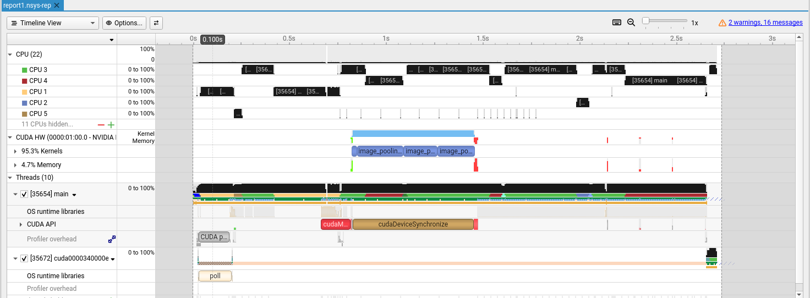
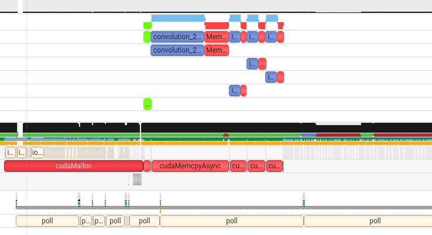

# 2D convolution application

This project was a school project commissioned by Vincent Claes for the class "Hardware accelerated computing" from the pxl. The goal is to write two application. A classic C application and a cuda accelerated program that does 2D convolution on images.

Eventually the program will be analyzed using tools like nvccprof and gprof to measure performance and identify the speed increase.

## Folder structure

There are two folders:

`cuda` contains the hardware accelerated code

`C` contains the regular code

## How to run

1. Make sure you have the cuda toolkit installed and the corresponding version of nsight systems

2. `cd` into the right directory

3. run `nvcc -g -G main.cu functions/convolution.cu functions/pooling.cu functions/tasklib.cu functions/tasklib.cu -o main` for the CUDA version or `gcc main.c -g -pg -O functions/tasklib.c functions/convolution.c functions/pooling.c -o main -lm` for the C version

4. Run the generated executable with the correct flags found beloz

5. If you want to profile the application you can use gprof on the gmon file generated after running the application or for the CUDA application you can preceed the executable name with `nsys profile` this generates a report that can be analyzed in nsight systems

### Usage of the executable

main.exe path_to_img.jpg -c path_to_convolution_output.jpg -p ath_to_max_pooling_output.jpg -a path_to_averagePool_output.jpg -m path_to_min_pooling_output.jpg

-c flag to perform convolution and provide a path to the output file

-p flag to perform max pooling and provide a path to the output file

-a flag to perform average pooling and provide a path to the output file

-m flag to perform min pooling and provide a path to the output file

## Our results

The first set of tests were done on a laptop that has a RTX1000 laptop GPU. 

### Timings

This is section will be a pure speed that highlighting the increases of each iteration using different images. The images used in the analysis:

img1: 1,914x1,566 (3.0MP)


img2: 512x640 (0.3MP)


img3: 3,324x4,672 (15.5MP)


#### C application

Running the C application gives the following time benchmarks:

img1.jpg

```
real    0m1.056s
user    0m1.035s
sys        0m0.013s
```

img2.jpg

```
real    0m0.153s
user    0m0.140s
sys        0m0.005s
```

img3.jpg

```
real    0m6.536s
user    0m6.437s
sys        0m0.072s
```

Once images get bigger than 0.5MP you see that the performance isn't within acceptable margins anymore and acceleration is required.

#### Acceleration without streams

Running the first cuda implementation of the algoritm we can immeatly see clear changes. The current implementation only makes use of grid-stride loops and kernel calls, not mmuch thought has been given to optimization

img1.jpg

```
real	0m0.493s
user	0m0.198s
sys	    0m0.270s
```

img2.jpg

```
real	0m0.345s
user	0m0.050s
sys	    0m0.258s
```

img3.jpg

```
real	0m1.997s
user	0m1.594s
sys	    0m0.332s
```

In this version only the big files clearly denote a big improvement, the copying of files is just very slow and the threads and blocks count are fairly low (only 64 threads and 32 blocks per kernel) which can be increased significantly already.

It is interesting to see how the smaller files currently perform better when done on the CPU only. With this implementation the turning point is at around images of 5MP in size

### Acceleration with streams

img1.jpg

```
real    0m0.479s
user    0m0.190s
sys        0m0.269s
```

img2.jpg

```
real    0m0.321s
user    0m0.043s
sys        0m0.250s
```

img3.jpg

```
real    0m1.790s
user    0m1.431s
sys        0m0.322s
```

Noteworthy here is again that there is a turning point where for smaller images the data copy speed is taking longer than the performance benefit gained of paralelism. While the turning point has shifted drastictly it is still clear that for smaller images that are smaller than 0.8MP the CPU version actually performs faster.

### Output

The output of the convolution is as expected, the convolution makes use of a 3x3 matrix

$$
\begin{pmatrix}
  -1 & 1 & -1 \\
  1 & 0 & 1 \\
  -1 & 1 & -1
\end{pmatrix}
$$


The pooling results in a smaller image, exactly half the size of the original as it groups multiple pixels together according to an algorithm

The max pooling output is as follows:


Which slightly differs from the min pooled, which is a bit dimmer, the effect cqn cleqrly be seen in the bottom of the pinguins fur as the min pool is more saturated


This then differs even more from the average pool which can produce color noise in area with a lot of color difference, it does look the best in areas with less color variety


### In depth analysis

Going from the C application to the accelerated one in Cuda was done in steps, after each step an analysis was done to see where performance gains could be made. An important consideration is that syscalls are not measured in gprof, since a lot of malloc is being used it is important to realize that the actual time to run is much higher, it is best to refer to the timing results below for a more accurate result.


For the in depth analysis we will take the biggest image in the collection, this to get the most detailed report. First we analyse the C implementation and profile it using gprof, a lot of these calls are from the stbi library, but since these won't be optimized and regarded as out of our control they have been removed from the list

```
Flat profile:

Each sample counts as 0.01 seconds.
  %   cumulative   self              self     total           
 time   seconds   seconds    calls  ms/call  ms/call  name    
 21.51      0.20     0.20        1   200.00   301.85  convolution_2d
 15.05      0.52     0.14 641081160     0.00     0.00  getPixel
  4.30      0.79     0.04        1    40.00    58.72  image_pooling_max
  2.15      0.81     0.02 11647296     0.00     0.00  getAverage
  1.08      0.88     0.01 19412160     0.00     0.00  getMax
  1.08      0.92     0.01        1    10.00    42.72  image_pooling_average
  1.08      0.93     0.01        1    10.00    26.72  image_pooling_min
  0.00      0.93     0.00  3882432     0.00     0.00  getMin
  0.00      0.93     0.00        1     0.00     0.00  black_borders
```

We initially expected that the biggest gain could be gained by speeding up the algorithms we had to implement, this does seem to be the case, I however did not expect that some of these pooling functions were already quite lightweight. I also noticed that the helper function getPixel is fairly heavy, while this function is used in every algorithms it still takes a lot of time. Usually looking into an accelerated math library could help or to rewrite the equations to gain speed benefits but this would go beyond the scope of this excersize so we will look into getting performance benefits by offloading compute to hardware.

We will be skipping over the direct 1to1 translation since this result holds no real insights. We skip to the grid-stride implementation where each kernel has been implemented without thread/block optimizations

Because the new version is built on cuda the profile tool has changed and instead of grpof we are now using `nsys` to profile the application



You will generate a report that looks like this, unfortunately symbol names for cpu functions are gone now, but it gives a very detailed overview of the GPU. One of the things that is immeatiatly clear is the speed increase of the convolutions, while it first took the longest is now is very short. I surprised me to see why the pooling functions haven't changes as much as compared to the convolution. My theory is that it is because the getmax/getmin/getaverage function calls are not performant on the GPU and slows down the kernel significantly. I have not been able to confirm this theory as even with rewriting the function the same result was appearant.

Eventually it was clear that I just forgot to assign more threads and blocks to the function, after increasing it the performance benefit was clearly seen. Currently these values are hard coded but a future improvement could be to dynamically assign threads as to fully optimize the GPU


The result already show a great improvement but the memory transfer is starting to become a significant portion of the workload. A potential optimization was to use different streams for each kernel so the cuda driver could be more creative to schedule the tasks and potentially speed up the process even more.



The streams were implemented nicely and there is a slight performance benefit, but it wasnt what I expected to happen. I thought that because the memory would be copied asynchronously that the red blocks would overlap with the blue, this would be a way bigger performance benefit. Another things that would be ideal is if it would work on callback basis, where the c function to save the image is called right after the memcopy is completed. But i think this would introduce multithreading which is also something that would go beyond the scope of the project.

So far this was the last improvement that was done

### Conclusion

The performance benefits are clear. While performance is a never ending battle with constant improvements, it is clear that the first improvements are usually the biggest gain, the time spent compared to the reward is worth it most of the time.
